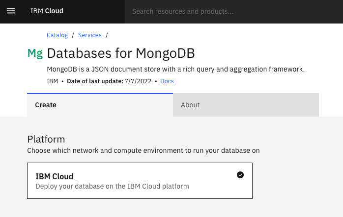
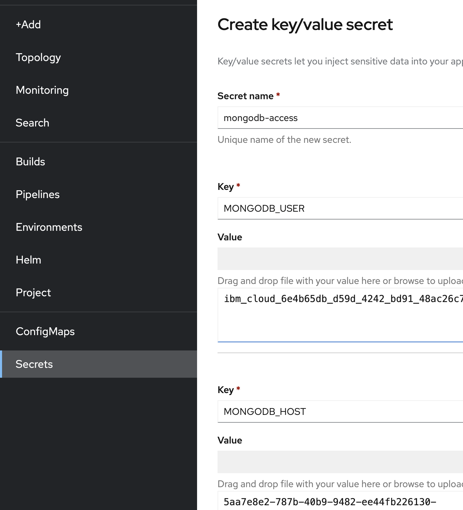
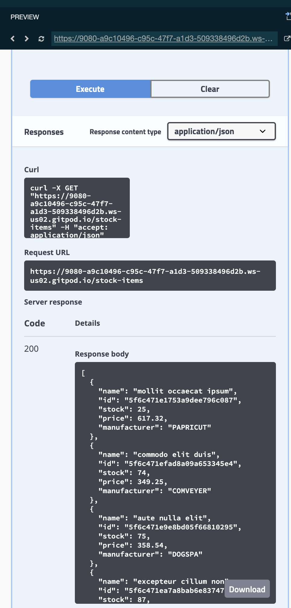
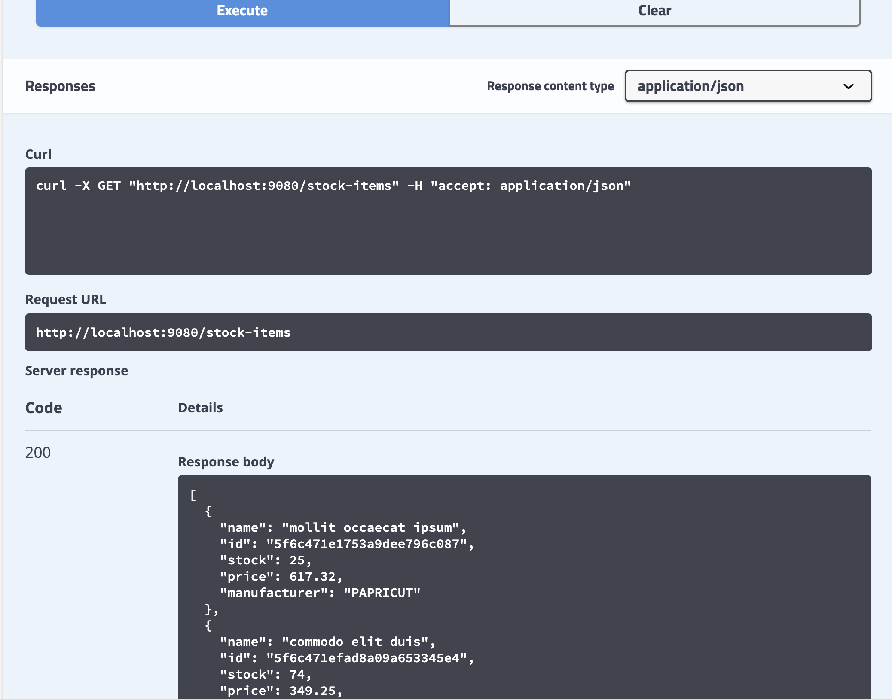

**Add a MongoDB integration to your backend service**

### Create a MongoDB instance

=== "On IBM Cloud"
    !!! warning
        The IBM Cloud service enforces SSL certificates usage to access the instance, however this is not covered in this tutorial, you can find the documentation for it [here](https://cloud.ibm.com/docs/databases-for-mongodb?topic=databases-for-mongodb-mongodb-external-app).

    Provision a MongoDB instance using the **Databases for MongoDB** service on IBM Cloud.

    - Log into the IBM Cloud console and look for the Databases for MongoDB service.

    - Configure it to your needs and create the instance.  
    

    - After your instance has provisioned, create a **Service Credential** to have access to your MongoDB instance.
    
      The service credential should contain informations to login to the instance. We will look for the database, the hostname, the username, the password and a base64 encoded certificate.  
      Decode the certificate, and create an OpenShift secret holding these values :
      ```bash
      oc create secret generic --from-literal=MONGODB_HOST=<HOST> --from-literal=MONGODB_PORT=<PORT> --from-literal=MONGODB_USER=<USER> --from-literal=MONGODB_DATABASE=<DATABASE> --from-literal=MONGODB_PASSWORD=<PASSWORD> --from-literal=MONGODB_CERT=<DECODED_CERT> mongodb-access
      ```
      You can also do this from the OpenShift console :
    

=== "On OpenShift"
    Install your self managed MongoDB instance using **Helm Charts**.

    - Login to your OpenShift cluster on a terminal and choose your development project.

    - Create a `mongodb.values.yaml` with the following content
    ```yaml title="mongodb.values.yaml"
    podSecurityContext:
      enabled: false
    containerSecurityContext:
      enabled: false
    auth:
      usernames:
        - myuser
      passwords:
        - mypassword
      databases:
        - inventory-db
    ```
    You can change the username, password and database name to your liking.

    - Run the following commands, it will install a Helm chart on your project, make sure to have `helm` installed locally.  
    ```bash
    $ helm repo add bitnami https://charts.bitnami.com/bitnami
    $ helm install mongodb bitnami/mongodb -f mongodb.values.yaml
    ```
    - Head over to your OpenShift console on the Topology perspective, you should the database created on your project.  
    
    - The Helm chart creates a secret holding MongoDB passwords, for consistency of this tutorial we will be creating another secret holding the same information, formatted in another way.  
      Run the following command :
      ```bash
      $ oc create secret generic --from-literal=MONGODB_HOST=mongodb --from-literal=MONGODB_PORT=27017 --from-literal=MONGODB_USER=myuser --from-literal=MONGODB_PASSWORD=mypassword --from-literal=MONGODB_DATABASE=inventory-db mongodb-access
      ```
      You should see the created secret `mongodb-access` on your OpenShift console :
    

=== "BYO MongoDB"
      Create your own MongoDB instance on any other cloud platform and bring the login credentials.

      Login to your OpenShift cluster and create a secret using the following command:
      ```bash
      $ oc create secret generic --from-literal=MONGODB_HOST=<HOST> --from-literal=MONGODB_PORT=<PORT> --from-literal=MONGODB_USER=<USER> --from-literal=MONGODB_PASSWORD=<PASSWORD> --from-literal=MONGODB_DATABASE=<DATABASE> mongodb-access
      ```
      Fill out the placeholders `<HOST>`, `<USER>`, `<PASSWORD>` and `<DATABASE>` with your own MongoDB instance's credentials.

#### Fill in the database with mock data
 - To help create test JSON data we are going to supply a template to the JSON Generator tool, this helps when creating dummy data for testing. Navigate to the following link [https://www.json-generator.com/](https://www.json-generator.com/).

 - Replace the default template with following template. This will enable a 100 records of test data to be created to represent a products database. Click on the *Generate* button.
 ```bash
 [
    '{{repeat(1, 100)}}',
    {
      _id: '{{objectId()}}',
      manufacturer: '{{company().toUpperCase()}}',
      name:  '{{lorem(3, "words")}}',
      price: '{{floating(10, 1000, 2, "0.00")}}',
      stock: '{{integer(1, 100)}}'
    }
  ]
 ```
 - Connect to your MongoDB instance, create a new collection called `stockItem` in your database and insert the generated data.

### Enable database in the solution

If you are starting from the solution, use the following steps to enable the Cloudant database

**Update the gradle config to include mongodb dependencies**

 - Head over to the `gradle` and create the following `build-mongodb.gradle` file:
 ```groovy title="gradle/build-mongodb.gradle"
 dependencies {
   implementation group: 'org.springframework.boot', name: 'spring-boot-starter-data-mongodb', version: '2.7.1'
   implementation group: 'org.springframework.boot', name: 'spring-boot-starter-data-jpa', version: '2.7.1'
 }
 ```
 - On the `build.gradle` file, add the following line :
 ```groovy title="build.gradle"
 apply from: 'gradle/build-mongodb.gradle'
 ```
 - Run `./gradlew build --refresh-dependencies` to validate the changes and load the libraries.

**Update application configuration to connect to database**

 - On the `src/main/resources/application.yml` file, update the `spring` by adding the content as such.
 ```yaml title="src/main/resources/application.yml"
 spring:
   data:
    mongodb:
      username: "${MONGODB_USERNAME:<USERNAME>}"
      password: "${MONGODB_PASSWORD:<PASSWORD>}"
      database: "${MONGODB_DATABASE:<DATABASE>}"
      authentication-database: "${MONGODB_DATABASE:<DATABASE>}"
      port: "${MONGODB_PORT:<PORT>}"
      host: "${MONGODB_HOST:<HOST>}"
   autoconfigure:
    exclude: org.springframework.boot.autoconfigure.jdbc.DataSourceAutoConfiguration
 ```
   Replace the placeholders with your database instance values.

**Update the configuration values in the Helm chart**

 - Open the `values.yaml` file and add the following value : 

 ```yaml title="chart/base/values.yaml"
 mongodbAccess=mongodb-access
 ```
 - Open the `deployment.yaml` file and add the following environment variables :

 ```yaml title="chart/base/templates/deployment.yaml"
 env:
   - name: MONGODB_USERNAME
     valueFrom:
       secretKeyRef:
         name: {{ .Values.mongodbAccess | quote }}
         key: MONGODB_USERNAME
   - name: MONGODB_PASSWORD
     valueFrom:
       secretKeyRef:
         name: {{ .Values.mongodbAccess | quote }}
         key: MONGODB_PASSWORD
   - name: MONGODB_DATABASE
     valueFrom:
       secretKeyRef:
         name: {{ .Values.mongodbAccess | quote }}
         key: MONGODB_DATABASE
   - name: MONGODB_PORT
     valueFrom:
       secretKeyRef:
         name: {{ .Values.mongodbAccess | quote }}
         key: MONGODB_PORT
   - name: MONGODB_HOST
     valueFrom:
       secretKeyRef:
         name: {{ .Values.mongodbAccess | quote }}
         key: MONGODB_HOST
 ```

**Update project files**

 - Update the `StockItem.java` file, add an `@Id` annotation on the `id` field.
 ```java title="src/main/java/com/ibm/inventory_management/models/StockItem.java"
 package com.ibm.inventory_management.models;

 import org.springframework.data.annotation.Id;

 import java.io.Serializable;

 public class StockItem implements Serializable {
   private String name;
   @Id
   private String id = null;
   private int stock = 0;
   private double price = 0.0;
   private String manufacturer = "";

   public StockItem() {
     super();
   }

   public StockItem(String id) {
     this.id = id;
   }

   public String getName() {
     return name;
   }

   public void setName(String name) {
     this.name = name;
   }

   public StockItem withName(String name) {
     this.setName(name);
     return this;
   }

   public String getId() {
     return id;
   }

   public void setId(String id) {
     this.id = id;
   }

   public StockItem withId(String id) {
     this.setId(id);
     return this;
   }

   public int getStock() {
     return stock;
   }

   public void setStock(int stock) {
     this.stock = stock;
   }

   public StockItem withStock(int stock) {
     this.setStock(stock);
     return this;
   }

   public double getPrice() {
     return price;
   }

   public void setPrice(double price) {
     this.price = price;
   }

   public StockItem withPrice(double price) {
     this.setPrice(price);
     return this;
   }

   public String getManufacturer() {
     return manufacturer;
   }

   public void setManufacturer(String manufacturer) {
     this.manufacturer = manufacturer;
   }

   public StockItem withManufacturer(String manufacturer) {
     this.setManufacturer(manufacturer);
     return this;
   }
 }
 ```

 - Create a `StockItemRepository.java` interface to interact with the database, put it in a `respositories` directory.
 ```java title="src/main/java/com/ibm/inventory_management/repositories/StockItemRepository.java"
 package com.ibm.inventory_management.repositories;

 import com.ibm.inventory_management.models.StockItem;
 import org.springframework.data.mongodb.repository.MongoRepository;
 import org.springframework.stereotype.Repository;

 @Repository
 public interface StockItemRepository extends MongoRepository<StockItem, String> {
 }
 ```

 - Update the `StockItemService.java` to use the repository.
 ```java title="src/main/java/com/ibm/inventory_management/services/StockItemService.java"
 package com.ibm.inventory_management.services;

 import java.util.List;

 import com.ibm.inventory_management.repositories.StockItemRepository;
 import org.springframework.beans.factory.annotation.Autowired;
 import org.springframework.stereotype.Service;

 import com.ibm.inventory_management.models.StockItem;

 @Service
 public class StockItemService implements StockItemApi {
       @Autowired
       private StockItemRepository stockItemRepository;
       @Override
       public List<StockItem> listStockItems() {
             return stockItemRepository.findAll();
       }
 }
 ```
### Running the application locally

- Start the application locally
  ```bash
  ./gradlew build
  ./gradlew bootrun
  ```


=== "Cloud Shell"
    - To view the running app click on the **Eye Icon** on the top right and select the port `9080` this will open a browser tab and display the running app on that port.

      
=== "Gitpod"
    - Once you run the application,gitpod gives the option to make the port "Public".Once you make the port Public, it gives you the option to "Open Preview" or "Open Browser".

      

    - Selecting "Open Preview" opens a window inside gitpod workspace tab.

      

    - Selecting "Open Browser" opens a new browser tab for accessing the URL.
=== "Cloud Ready Workspaces"
    - Click on open link
      

    - To view this application in new tab click top right corner arrow icon
      
=== "Desktop/Laptop"
    - Open a browser to [`http://localhost:9080/swagger-ui.html`](http://localhost:9080:swagger-ui.html)
---

- Once the application is up, go the Swagger UI and execute get `stock-items`.

-  You should be able to see all the data you pushed to the database
   through ./dataload.sh

   

Prebuilt solution for this can be found here: [Inventory Management Service MongoDB solution template](https://github.com/ibm-ecosystem-lab/inventory-management-svc-mongodb)
!!! note
    You will need to setup your own database credentials in the `application.yml` file.


