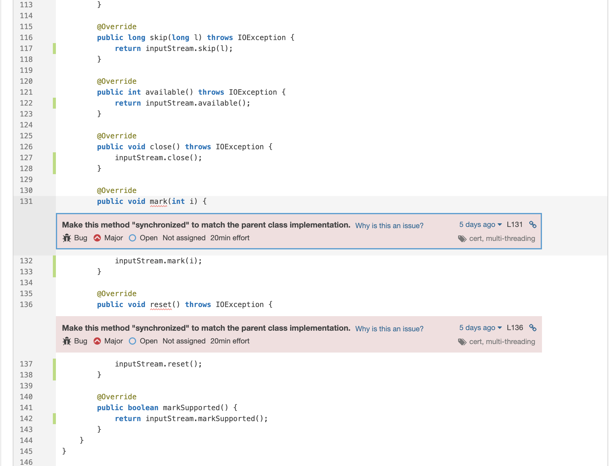
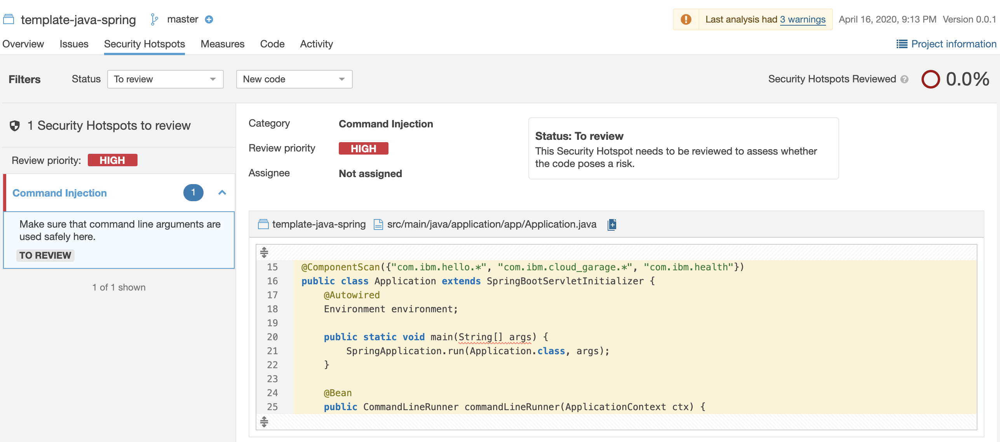
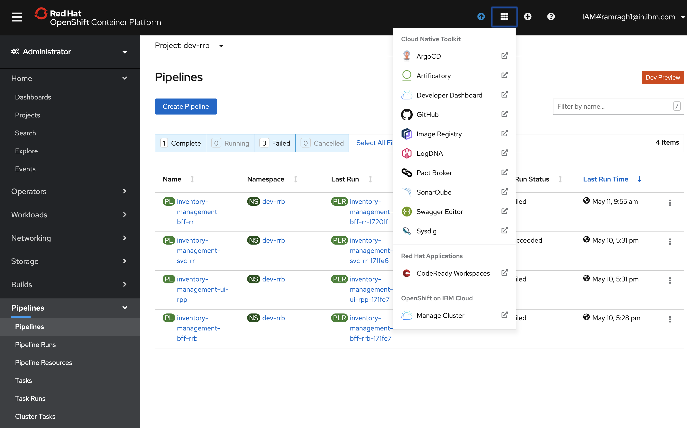

In IBM Garage Method, one of the Develop practices is to [automate tests for continuous delivery](https://www.ibm.com/garage/method/practices/code/practice_automated_testing/), in part by using [static source code analysis tools](https://www.ibm.com/garage/method/practices/code/practice_automated_testing/tool_lint). [SonarQube](https://www.sonarqube.org/) automates performing static code analysis and enables it to be added to a continuous integration pipeline. The <Globals name="env" />'s CI pipeline ([Jenkins](/guides/continuous-integration), [Tekton](/guides/continuous-integration-tekton), etc.) includes a SonarQube stage. Simply by building your app using the pipeline, your code gets analyzed, and the SonarQube UI displays the findings.

## What is code analysis

Static code analysis (a.k.a. code analysis) is a method of debugging by performing automated evaluation of code
without executing the program. The analysis is structured as a set of coding rules that evaluate the code's quality.
Analysis can be performed on source code or compiled code. The analyzer must support the programming language
the code is written in so that it can parse the code like a compiler or simulate its execution.

Static code analysis differs from dynamic analysis, which observes and evaluates a running program. Dynamic analysis
requires test inputs and can measure user functionality as well as runtime qualities like execution time and resource consumption.
A code review is static code analysis performed by a human.

Static code analysis can evaluate several different aspects of code quality, such as: 

- **Reliability**
    - **Bug**: Programming error that breaks functionality
- **Security**
    - **Vulnerability**: A point in a program that can be attacked
    - **Hotspot**: Code that uses a security-sensitive API
- **Maintainability**
    - **Coding standards**: Practices that increase the human readability and understandability of code
    - **Code smell**: Code that is confusing and difficult to maintain
    - **Technical debt**: Estimated time required to fix all maintainability issues
- **Complexity**
    - **Code complexity**: Code's control flow and number of paths through the code
- **Duplications**
    - **Duplicated code**: The same code sequence appearing more than once in the same program
- **Manageability**
    - **Testability**: How easily tests can be developed and used to show the program meets requirements
    - **Portability**: How easily the program can be reused in different environments
    - **Reusability**: The program's modularity, loose coupling, and limited interdependencies

Static code analysis collects several metrics that measure code quality:

- **Issues**
    - **Type**: Bug, Vulnerability, Code Smell
    - **Severity**
        - **Blocker**: Bug with a high probability to impact the behavior of the application in production
        - **Critical**: Bug with a low probability to impact the behavior of the application in production, or a security vulnerability
        - **Major**: Code smell with high impact to developer productivity
        - **Minor**: Code smell with slight impact to developer productivity
        - **Info**: Neither a bug nor a code smell, just a finding
- **Size**
    - **Classes**: Number of class definitions (concrete, abstract, nested, interfaces, enums, annotations)
    - **Lines of code**: Linespace separated text that is not whitespace or comments
    - **Comment lines**: Linespace separated text containing significant commentary or commented-out code
- **Coverage**
    - **Test coverage**: Code that was executed by a test suite

A **Quality gate** defines a policy that assesses pass/fail whether or not the number of issues and their severity is acceptable.

## What is SonarQube

SonarQube performs static code analysis to evaluate code quality, using analysis rules that focus on three areas:

- **Code Reliability**: Detect bugs that will impact end-user functionality
- **Application Security**: Detect vulnerabilities and hotspots that can be exploited to compromise the program
- **Technical Debt**: Keep your codebase maintainable to increase developer velocity

SonarQube [plugs into the application lifecycle management (ALM)](https://docs.sonarqube.org/latest/architecture/architecture-integration/#header-2) process to make continuous inspection part of continuous integration.
Adding code analysis to ALM provides regular, timely feedback on the quality of the code being produced.
The goal is to detect problems as soon as possible so that they can be resolved before they can impact production end users.

The continuous integration (CI) server integrates SonarQube into the ALM.
The SonarQube solution consists of several components: The central component is the SonarQube Server,
which runs the SonarScanner, processes the resulting analysis reports, stores the reports in SonarQube Database,
and displays the reports in the SonarQube UI.
A CI server uses a stage/goal/task in its build automation to trigger the language-specific SonarScanner to scan the code being built.
Developers can view the resulting analysis report in the SonarQube UI.

## Code Analysis in the Pipeline

In the CI pipeline, the *Sonar scan* stage triggers the SonarScanner in SonarQube.
Follow these directions to see code analysis in action:

Deploy the <Globals name="template" /> named Spring Boot Microservice.

- Follow the directions in [Deploying an App](/developer-intermediate/deploy-app)
    - Deploy the Spring Boot Microservice template
    - Name the new repo something like `sonar-java`
    - Be sure to run the CI pipeline (using the version igc-java-gradle-v1-x-0) for your project, and confirm that it runs the Sonar scan in test stage

Examine SonarQube's analysis report for your app

- Go to the OpenShift console. On the top, you will find an icon of a square made of 9 small squares.
- Clicking on that icon will give you all the tools shortcut. Select SonarQube to open the SonarQube dashboard.
- Use `oc credentials` to get the user name and password if you a prompted to log in

- Go to the Projects page

    You should see your project in the list, such as `bwoolf1.sonar-java`.

    

    The project summary shows several characteristics measured in the app:
    - The quality gate passed
   - Several issues were found, categorized by type
        - 2 bugs for a C rating
        - 0 vulnerabilities for an A rating
        - 17 code smells but an A rating
        - None of the code was tested
        - None of it is duplicate code
    - It scanned 1.5k lines of code written in Java, a small program (XS, S, M, L, XL)

- In the Projects list, click on the project name (such as `bwoolf1.sonar-java`) to open your project

    The project overview shows more detail about how many issues were found in the app
    - Reliability: 2 bugs for a C rating
    - Security: 1 security hotspot but an A rating
    - Maintainability: 17 code smells, 2 hrs of technical debt but an A rating
    - Coverage: 7 unit tests
    - Duplications: 0 duplicated blocks

### Examine the issues

Use the SonarQube dashboard to explore the issues that it found in your project.

- In the Reliability pane of the project's Overview page, click on the "2" to open the Issues page

    The Issues page, filtered for bugs, shows two issues. Both concern "synchronized" methods.

    

- In the Issues list, click on either issue to see where the issues appeared in the code

    The Issues detail shows the source code file for the Java class.
    The issue descriptions are embedded after the `mark` and `reset` method signatures.

    

- In either issue, press the **Why is this an issue?** button.

    SonarQube displays the details of its "Overrides should match their parent class methods in synchronization" rule.

    Now you need to investigate to figure out why the code violates this rule.

    Want to see if you can track down the problem before seeing the solution?
    What to fix is pretty obvious--the Rule explains what to do--but tracking down why takes some effort.

    -----

    Here's the solution:

    The error is not in the file's parent class, `ResettableHttpServletRequest`, but in its embedded class, `SimpleServletInputStream`,
    which extends `javax.servlet.ServletInputStream`. The Javadocs for `ServletInputStream` show that it extends
    `java.io.InputStream`. The [original Java 1.0 Javadocs](http://physics.usc.edu/java/api/java.io.InputStream.html)
    show that these methods in InputStream are indeed synchronized:

    ```java
    public synchronized void mark(int readlimit)
    . . .
    public synchronized void reset() throws IOException
    ```

    [More recent Javadocs](https://docs.oracle.com/javase/7/docs/api/java/io/InputStream.html#mark(int))
    haven't shown these signatures for years, but the compiler says the class is still defined that way.
    There's some debate about [whether mark and reset really need to be synchronized](https://stackoverflow.com/questions/33525923/synchronized-methods-in-java-io-streams). But SonarQube doesn't judge, it just reports:
    Since the superclass defined the method signatures as synchronized,
    SonarQube is warning that the subclass is supposed to do so as well.

### Examine the other issues

Besides the bugs, SonarQube also found issues that are hotspots and code smells.

- In the SonarQube dashboard, go back to the Issues page

- Click on the "1" above Security hotspots

    The issue warns to "Make sure that command line arguments are used safely here."

    

    SonarQube considers any class that has a `public static void main(String[] args)` method to be a potential vulnerability.
    As the rule explains, "Command line arguments can be dangerous just like any other user input. They should never be used without being first validated and sanitized." This method passes them through unchecked, which is risky.

- Back in the Issues page, click on "17" code smells

     SonarQube found issues such as:
     - Remove this unused import 'java.lang.System.lineSeparator'.
     - Move constants to a class or enum.
     - This block of commented-out lines of code should be removed.
     - Replace this use of System.out or System.err by a logger.

     None of these break your app's functionality, but they do make the code more difficult to maintain.

## Give it a try

As we saw earlier, SonarQube found two bugs in our Java app. Let's do something about that.


### Add a quality gate to SonarQube

The first problem is that the quality gate says that the app passed. The default quality gate is OK with those two bugs, but we're not.

Let's create a new quality gate that checks for bugs.

- Open the SonarQube dashboard through OpenShift console shortcut as shown below:



- To create and install a new quality gate, first log in to SonarQube

- Go to the Quality Gates page

- Make a copy of the default gate named *Sonar way*, give it a name like `better gate {your initials}`, i.e. `better gate bw`

- Add a condition, Bugs	is greater than	0

- Add your project to this gate

Run the pipeline again to scan the code again.

- Back in the OpenShift console, on the Application Console > Builds > Pipelines page, press Start Pipeline

- After the Sonar Scan stage completes, go back to the SonarQube dashboard and take a look at your project


Good news, the quality gate is working and SonarQube fails the project now!

### Fix the code

 Let's fix the problems. As discussed before, the bugs are that two methods need to be marked as synchronized. Let's fix the code.

- Edit the class `com.ibm.cloud_garage.logging.inbound.ResettableHttpServletRequest`

- Edit the methods `mark` and `reset` to make them both `synchronized`

```java
public synchronized void mark(int i) {
. . .
public synchronized void reset() throws IOException {
```

- Push the change to the server repo, which runs the pipeline again, and this time the Quality Gate stage passes

- Check the project in SonarQube and see that it now has 0 bugs and has now passed


**Extra credit**: The code still has 17 code smells. Go fix those!

## Conclusion

It's a good idea to incorporate code analysis as part of your application development lifecycle,
so you can use its findings to help enforce and improve your code quality.
Here, the <Globals name="env" /> uses SonarQube, but you never had to run SonarQube.
Just run the <Globals name="env" />'s build pipeline on your app and it gets scanned automatically.
After running the pipeline, open the SonarQube UI and browse the findings in your app's project to figure
out what code you ought to fix.
