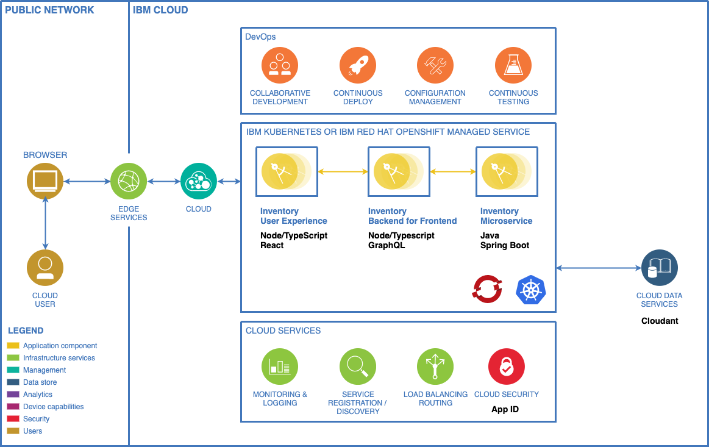
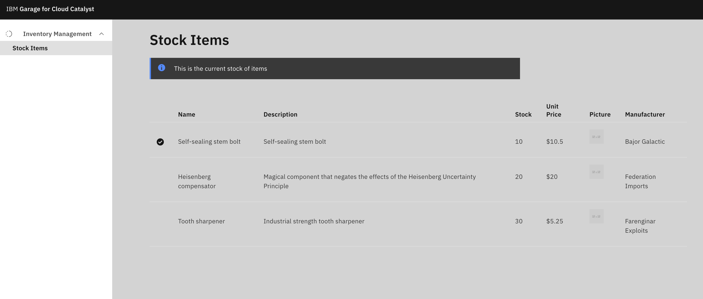

<!--- cSpell:ignore wireframe -->

**Develop and deploy an example microservices application**

Develop an example application with a three-tier microservices architecture and deploy it in IBM Cloud Kubernetes Service or Red Hat OpenShift on IBM Cloud using the IBM Garage Cloud-Native Toolkit Developer Environment including its Code Patterns.

## Business Need

In this guide, imagine you have completed an [Enterprise Design Thinking Workshop](https://www.ibm.com/garage/method/practices/think/enterprise-design-thinking/) and the result is an MVP statement that defines the desired business outcomes. Use the steps below to help deliver this MVP quickly while following [Garage Method best practices](https://www.ibm.com/garage/method/cloud/).

### MVP Statement

An [MVP](https://www.ibm.com/garage/method/practices/think/practice_minimum_viable_product/) is a [first hill](https://www.ibm.com/garage/method/practices/think/practice_hills/). Here's the hill statement for the MVP we're going to build:

- **Who**: Distribution employees in each of the regional warehouses

- **What**: A secure web application that enables easy access to list of product [SKU](https://en.wikipedia.org/wiki/Stock_keeping_unit) inventory levels and inventory locations

- **Wow**: Make the system appealing and easy to use. Deliver it hosted on the IBM Cloud platform. Develop it quickly as a [minimum viable product](https://www.ibm.com/garage/method/practices/think/practice_minimum_viable_product/). Use the latest managed container runtimes and DevOps best practices to enable post MVP feature improvements. Simulate a release to a _Test_ environment.

## Architecture

We will build the Micro App using a three-tier microservices architecture. Each tier encapsulates a clean separation of concerns. Each app component will be modelled using _microservices_ and use a number of [polyglot](https://searchsoftwarequality.techtarget.com/definition/polyglot-programming) programming languages and frameworks. Data will be stored in IBM Cloudant and the Micro App will be secured using IBM App ID.

### User interface

The Micro App's user interface will look like this [wireframe](https://www.ibm.com/garage/method/practices/think/practice_wireframes/):

### Technical Requirements

The Micro App should adhere to the following technical requirements:

- Microservices
    - Stateless
    - REST APIs
    - Polyglot
- DevOps with CI/CD (continuous integration and continuous delivery)
    - Monitoring and logging
    - Code analysis
    - App security
- Deployed to Red Hat OpenShift on IBM Cloud or IBM Cloud Kubernetes Service
- Follow the [Carbon Design System](https://www.carbondesignsystem.com/) user experience

## Guide

You will approach creating the Micro App bottom up, meaning you will start by creating the backend microservice that manages integration with the data persistence and then build out the digital channel using a backend for frontend pattern. Finally, you will add a web UI to the solution.
